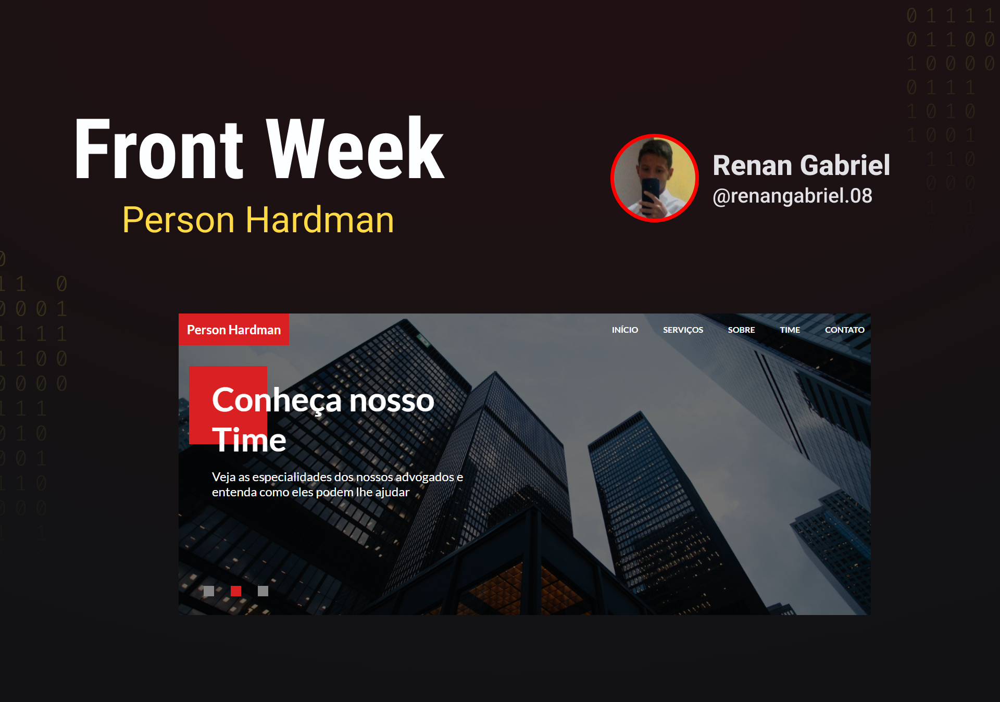

<h1 align="center"> PERSON HARDMAN </h1>

Projeto de um site de uma empresa administrativa, criada com inspiração na série "Homens de Terno".

  <a href="#-tecnologias">Tecnologias</a>&nbsp;&nbsp;&nbsp;|&nbsp;&nbsp;&nbsp;
  <a href="#-projeto">Projeto</a>&nbsp;&nbsp;&nbsp;|&nbsp;&nbsp;&nbsp;
  <a href="#memo-licença">Licença</a>

  

 

  

## 🚀 Tecnologias

Esse projeto foi desenvolvido com as seguintes tecnologias:

- HTML e CSS
- JavaScript
- Git e Github

## 💻 Projeto

Person Hardman é um projeto onde foca-se numa empresa administrativa inspirada na série "Homens de Terno".

## :memo: Licença

Esse projeto está sob a licença MIT.

---

Feito por Renan com apoio do projeto da Front Week :wave: [Participe da comunidade deles!](https://discord.gg/69H2SDRbH3)